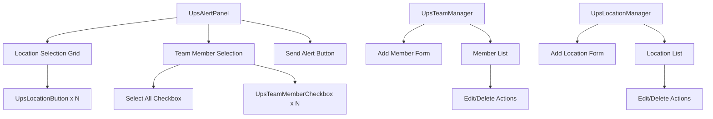
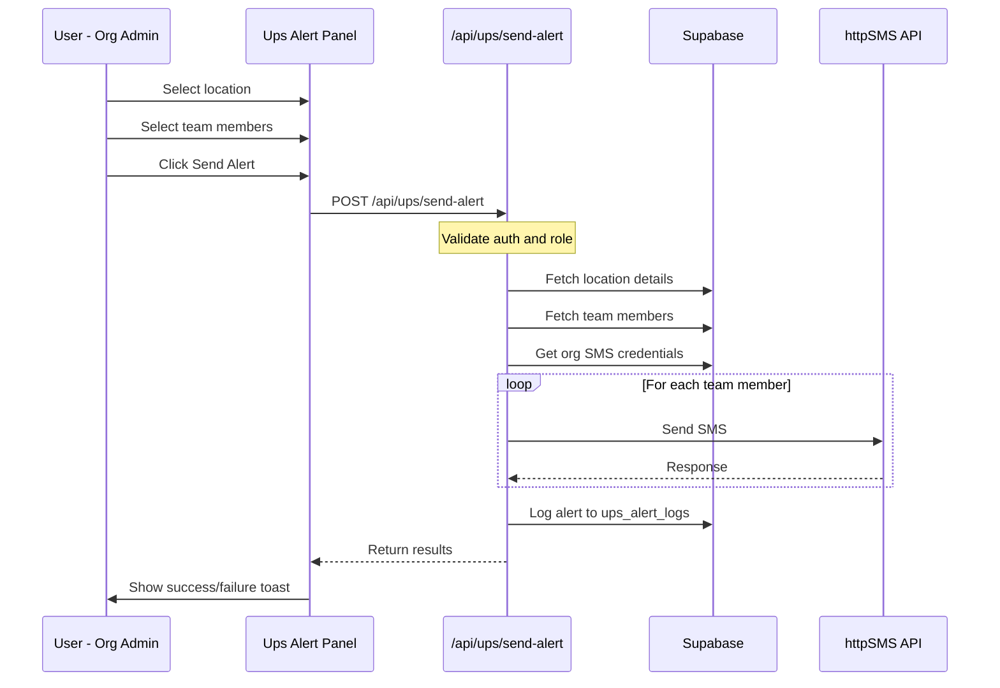

# Ups SMS Alert Feature - Architecture Document

## Overview

The "Ups" SMS Alert feature enables org_admin and superadmin users to quickly send SMS notifications to salespeople when a customer arrives on the lot. This feature is designed for speed and ease of use, targeting tech-illiterate users who need one-tap functionality.

## Feature Requirements Summary

- **Team Members Management**: Add/remove sales team members with name and phone number
- **Location Presets**: Pre-defined locations with one-tap selection
- **Alert Sending**: Select recipients, choose location, send with one tap
- **Access Control**: Only org_admin and superadmin can access

---

## 1. Database Schema

### New Tables

#### `ups_team_members`

Stores sales team members who can receive UP alerts. These are separate from the `profiles` table because:
1. Not all salespeople may have LeadSniper accounts
2. Phone numbers for alerts may differ from account notification numbers
3. Simpler management for non-technical users

```sql
CREATE TABLE ups_team_members (
    id UUID DEFAULT uuid_generate_v4() PRIMARY KEY,
    organization_id UUID NOT NULL REFERENCES organizations(id) ON DELETE CASCADE,
    name TEXT NOT NULL,
    phone_number TEXT NOT NULL,
    is_active BOOLEAN DEFAULT TRUE NOT NULL,
    display_order INTEGER DEFAULT 0 NOT NULL,
    created_at TIMESTAMPTZ DEFAULT NOW() NOT NULL,
    updated_at TIMESTAMPTZ DEFAULT NOW() NOT NULL,
    
    -- Ensure unique phone per organization
    UNIQUE(organization_id, phone_number)
);

-- Indexes
CREATE INDEX idx_ups_team_members_org ON ups_team_members(organization_id);
CREATE INDEX idx_ups_team_members_active ON ups_team_members(organization_id, is_active);

-- Enable RLS
ALTER TABLE ups_team_members ENABLE ROW LEVEL SECURITY;

-- Trigger for updated_at
CREATE TRIGGER update_ups_team_members_updated_at
    BEFORE UPDATE ON ups_team_members
    FOR EACH ROW
    EXECUTE FUNCTION update_updated_at();
```

#### `ups_locations`

Stores location presets for each organization.

```sql
CREATE TABLE ups_locations (
    id UUID DEFAULT uuid_generate_v4() PRIMARY KEY,
    organization_id UUID NOT NULL REFERENCES organizations(id) ON DELETE CASCADE,
    name TEXT NOT NULL,
    is_active BOOLEAN DEFAULT TRUE NOT NULL,
    display_order INTEGER DEFAULT 0 NOT NULL,
    created_at TIMESTAMPTZ DEFAULT NOW() NOT NULL,
    updated_at TIMESTAMPTZ DEFAULT NOW() NOT NULL,
    
    -- Ensure unique location name per organization
    UNIQUE(organization_id, name)
);

-- Indexes
CREATE INDEX idx_ups_locations_org ON ups_locations(organization_id);
CREATE INDEX idx_ups_locations_active ON ups_locations(organization_id, is_active);

-- Enable RLS
ALTER TABLE ups_locations ENABLE ROW LEVEL SECURITY;

-- Trigger for updated_at
CREATE TRIGGER update_ups_locations_updated_at
    BEFORE UPDATE ON ups_locations
    FOR EACH ROW
    EXECUTE FUNCTION update_updated_at();
```

#### `ups_alert_logs`

Tracks sent alerts for auditing and analytics.

```sql
CREATE TABLE ups_alert_logs (
    id UUID DEFAULT uuid_generate_v4() PRIMARY KEY,
    organization_id UUID NOT NULL REFERENCES organizations(id) ON DELETE CASCADE,
    location_id UUID REFERENCES ups_locations(id) ON DELETE SET NULL,
    location_name TEXT NOT NULL, -- Denormalized for history
    sent_by UUID NOT NULL REFERENCES profiles(id) ON DELETE SET NULL,
    recipient_count INTEGER NOT NULL,
    recipients JSONB NOT NULL, -- Array of {id, name, phone_number, status}
    created_at TIMESTAMPTZ DEFAULT NOW() NOT NULL
);

-- Indexes
CREATE INDEX idx_ups_alert_logs_org ON ups_alert_logs(organization_id);
CREATE INDEX idx_ups_alert_logs_created ON ups_alert_logs(created_at DESC);

-- Enable RLS
ALTER TABLE ups_alert_logs ENABLE ROW LEVEL SECURITY;
```

### RLS Policies

```sql
-- UPS_TEAM_MEMBERS Policies
CREATE POLICY "Superadmins can manage all ups_team_members" ON ups_team_members
    FOR ALL USING (get_user_role() = 'superadmin');

CREATE POLICY "Org admins can manage their ups_team_members" ON ups_team_members
    FOR ALL USING (
        get_user_role() = 'org_admin' 
        AND organization_id = get_user_organization()
    );

-- UPS_LOCATIONS Policies
CREATE POLICY "Superadmins can manage all ups_locations" ON ups_locations
    FOR ALL USING (get_user_role() = 'superadmin');

CREATE POLICY "Org admins can manage their ups_locations" ON ups_locations
    FOR ALL USING (
        get_user_role() = 'org_admin' 
        AND organization_id = get_user_organization()
    );

-- UPS_ALERT_LOGS Policies
CREATE POLICY "Superadmins can view all ups_alert_logs" ON ups_alert_logs
    FOR SELECT USING (get_user_role() = 'superadmin');

CREATE POLICY "Org admins can view their ups_alert_logs" ON ups_alert_logs
    FOR SELECT USING (
        get_user_role() = 'org_admin' 
        AND organization_id = get_user_organization()
    );

CREATE POLICY "Admins can insert ups_alert_logs" ON ups_alert_logs
    FOR INSERT WITH CHECK (
        get_user_role() IN ('superadmin', 'org_admin')
        AND (get_user_role() = 'superadmin' OR organization_id = get_user_organization())
    );
```

### Default Location Seeding

When a new organization is created, seed default locations:

```sql
CREATE OR REPLACE FUNCTION seed_default_ups_locations()
RETURNS TRIGGER AS $$
BEGIN
    INSERT INTO ups_locations (organization_id, name, display_order) VALUES
        (NEW.id, 'Used Lot', 1),
        (NEW.id, 'New Lot', 2),
        (NEW.id, 'Service Drive', 3),
        (NEW.id, 'Showroom', 4);
    RETURN NEW;
END;
$$ LANGUAGE plpgsql SECURITY DEFINER;

CREATE TRIGGER on_organization_created_seed_ups_locations
    AFTER INSERT ON organizations
    FOR EACH ROW
    EXECUTE FUNCTION seed_default_ups_locations();
```

---

## 2. API Endpoints

### Team Members API

#### `GET /api/ups/team-members`
Fetch all team members for the organization.

```typescript
// Response
{
  members: UpsTeamMember[]
}
```

#### `POST /api/ups/team-members`
Add a new team member.

```typescript
// Request
{
  name: string;
  phone_number: string;
}

// Response
{
  member: UpsTeamMember
}
```

#### `PUT /api/ups/team-members/[id]`
Update a team member.

```typescript
// Request
{
  name?: string;
  phone_number?: string;
  is_active?: boolean;
  display_order?: number;
}

// Response
{
  member: UpsTeamMember
}
```

#### `DELETE /api/ups/team-members/[id]`
Delete a team member.

```typescript
// Response
{
  success: true
}
```

### Locations API

#### `GET /api/ups/locations`
Fetch all locations for the organization.

```typescript
// Response
{
  locations: UpsLocation[]
}
```

#### `POST /api/ups/locations`
Add a new location.

```typescript
// Request
{
  name: string;
}

// Response
{
  location: UpsLocation
}
```

#### `PUT /api/ups/locations/[id]`
Update a location.

```typescript
// Request
{
  name?: string;
  is_active?: boolean;
  display_order?: number;
}

// Response
{
  location: UpsLocation
}
```

#### `DELETE /api/ups/locations/[id]`
Delete a location.

```typescript
// Response
{
  success: true
}
```

### Alert Sending API

#### `POST /api/ups/send-alert`
Send UP alert to selected team members.

```typescript
// Request
{
  location_id: string;
  member_ids: string[]; // Array of team member IDs to notify
}

// Response
{
  success: true;
  sent_count: number;
  failed_count: number;
  results: {
    member_id: string;
    status: 'sent' | 'failed';
    error?: string;
  }[]
}
```

### API Implementation Pattern

Following the existing pattern from [`route.ts`](web/src/app/api/team/members/route.ts):

```typescript
// web/src/app/api/ups/send-alert/route.ts
import { NextRequest, NextResponse } from 'next/server';
import { createClient } from '@/lib/supabase/server';
import { createAdminClient } from '@/lib/supabase/admin';

export async function POST(request: NextRequest) {
  try {
    const supabase = await createClient();
    const adminClient = createAdminClient();

    // Verify authentication
    const { data: { user }, error: authError } = await supabase.auth.getUser();
    if (authError || !user) {
      return NextResponse.json({ error: 'Unauthorized' }, { status: 401 });
    }

    // Get user profile and verify role
    const { data: profile } = await adminClient
      .from('profiles')
      .select('*, organization:organizations(*)')
      .eq('id', user.id)
      .single();

    if (!profile || !['superadmin', 'org_admin'].includes(profile.role)) {
      return NextResponse.json({ error: 'Forbidden' }, { status: 403 });
    }

    // Parse request body
    const { location_id, member_ids } = await request.json();

    // Validate inputs
    if (!location_id || !member_ids?.length) {
      return NextResponse.json(
        { error: 'Missing required fields' },
        { status: 400 }
      );
    }

    // Fetch location
    const { data: location } = await adminClient
      .from('ups_locations')
      .select('*')
      .eq('id', location_id)
      .single();

    if (!location) {
      return NextResponse.json({ error: 'Location not found' }, { status: 404 });
    }

    // Fetch team members
    const { data: members } = await adminClient
      .from('ups_team_members')
      .select('*')
      .in('id', member_ids)
      .eq('is_active', true);

    if (!members?.length) {
      return NextResponse.json({ error: 'No valid recipients' }, { status: 400 });
    }

    // Get organization SMS credentials
    const org = profile.organization;
    if (!org?.httpsms_api_key || !org?.httpsms_from_number) {
      return NextResponse.json(
        { error: 'SMS not configured for organization' },
        { status: 400 }
      );
    }

    // Send SMS to each member
    const message = `UP! Customer on the ${location.name}`;
    const results = [];

    for (const member of members) {
      try {
        const response = await fetch('https://api.httpsms.com/v1/messages/send', {
          method: 'POST',
          headers: {
            'x-api-key': org.httpsms_api_key,
            'Accept': 'application/json',
            'Content-Type': 'application/json',
          },
          body: JSON.stringify({
            content: message,
            from: org.httpsms_from_number,
            to: member.phone_number,
          }),
        });

        const data = await response.json();
        results.push({
          member_id: member.id,
          name: member.name,
          phone_number: member.phone_number,
          status: response.ok ? 'sent' : 'failed',
          error: response.ok ? undefined : data.message,
        });
      } catch (error) {
        results.push({
          member_id: member.id,
          name: member.name,
          phone_number: member.phone_number,
          status: 'failed',
          error: 'Network error',
        });
      }
    }

    // Log the alert
    await adminClient.from('ups_alert_logs').insert({
      organization_id: profile.organization_id,
      location_id: location.id,
      location_name: location.name,
      sent_by: user.id,
      recipient_count: members.length,
      recipients: results,
    });

    const sentCount = results.filter(r => r.status === 'sent').length;
    const failedCount = results.filter(r => r.status === 'failed').length;

    return NextResponse.json({
      success: true,
      sent_count: sentCount,
      failed_count: failedCount,
      results,
    });

  } catch (error) {
    console.error('Send alert error:', error);
    return NextResponse.json(
      { error: 'Internal server error' },
      { status: 500 }
    );
  }
}
```

---

## 3. Component Structure

### New Components

```
web/src/components/ups/
├── ups-alert-panel.tsx      # Main alert sending interface
├── ups-team-manager.tsx     # Team member CRUD interface
├── ups-location-manager.tsx # Location CRUD interface
├── ups-member-checkbox.tsx  # Individual member selection checkbox
└── ups-location-button.tsx  # Location selection button
```

### Component Hierarchy



---

## 4. File Structure

### New Files to Create

```
web/
├── src/
│   ├── app/
│   │   ├── api/
│   │   │   └── ups/
│   │   │       ├── team-members/
│   │   │       │   ├── route.ts           # GET, POST
│   │   │       │   └── [id]/
│   │   │       │       └── route.ts       # PUT, DELETE
│   │   │       ├── locations/
│   │   │       │   ├── route.ts           # GET, POST
│   │   │       │   └── [id]/
│   │   │       │       └── route.ts       # PUT, DELETE
│   │   │       └── send-alert/
│   │   │           └── route.ts           # POST
│   │   └── dashboard/
│   │       └── ups/
│   │           └── page.tsx               # Main UPS page
│   ├── components/
│   │   └── ups/
│   │       ├── ups-alert-panel.tsx
│   │       ├── ups-team-manager.tsx
│   │       ├── ups-location-manager.tsx
│   │       ├── ups-member-checkbox.tsx
│   │       └── ups-location-button.tsx
│   └── lib/
│       └── types.ts                       # Add new types
└── supabase/
    └── migrations/
        └── 004_ups_feature.sql            # New migration
```

### Type Definitions

Add to [`types.ts`](web/src/lib/types.ts):

```typescript
// UPS Alert Feature Types
export interface UpsTeamMember {
  id: string;
  organization_id: string;
  name: string;
  phone_number: string;
  is_active: boolean;
  display_order: number;
  created_at: string;
  updated_at: string;
}

export interface UpsLocation {
  id: string;
  organization_id: string;
  name: string;
  is_active: boolean;
  display_order: number;
  created_at: string;
  updated_at: string;
}

export interface UpsAlertLog {
  id: string;
  organization_id: string;
  location_id: string | null;
  location_name: string;
  sent_by: string;
  recipient_count: number;
  recipients: UpsAlertRecipient[];
  created_at: string;
}

export interface UpsAlertRecipient {
  member_id: string;
  name: string;
  phone_number: string;
  status: 'sent' | 'failed';
  error?: string;
}
```

---

## 5. UI/UX Design

### Design Principles

1. **Speed First**: Minimize taps/clicks to send an alert
2. **Large Touch Targets**: Big buttons for easy tapping
3. **Visual Feedback**: Clear confirmation of actions
4. **Error Prevention**: Disable send until valid selection

### Main Alert Panel Layout

```
┌─────────────────────────────────────────────────────────────┐
│  📍 Select Location                                         │
├─────────────────────────────────────────────────────────────┤
│  ┌─────────────┐  ┌─────────────┐  ┌─────────────┐         │
│  │  Used Lot   │  │  New Lot    │  │  Service    │         │
│  │     🚗      │  │     🚙      │  │   Drive 🔧  │         │
│  └─────────────┘  └─────────────┘  └─────────────┘         │
│  ┌─────────────┐                                            │
│  │  Showroom   │                                            │
│  │     🏢      │                                            │
│  └─────────────┘                                            │
├─────────────────────────────────────────────────────────────┤
│  👥 Select Team Members                    ☑️ Select All    │
├─────────────────────────────────────────────────────────────┤
│  ☑️ John Smith          ☑️ Jane Doe                         │
│  ☑️ Mike Johnson        ☑️ Sarah Wilson                     │
│  ☑️ Tom Brown           ☐ Lisa Davis                        │
├─────────────────────────────────────────────────────────────┤
│                                                             │
│  ┌─────────────────────────────────────────────────────┐   │
│  │                                                     │   │
│  │              🔔 SEND ALERT                          │   │
│  │                                                     │   │
│  │         Notify 5 team members                       │   │
│  │                                                     │   │
│  └─────────────────────────────────────────────────────┘   │
│                                                             │
└─────────────────────────────────────────────────────────────┘
```

### Component Specifications

#### Location Buttons
- **Size**: Large, minimum 100px x 80px
- **Style**: Card-like with subtle border
- **Selected State**: Emerald border and background tint
- **Hover**: Slight scale and glow effect

```tsx
// UpsLocationButton styling
className={cn(
  "p-4 rounded-xl border-2 transition-all duration-200 cursor-pointer",
  "min-w-[100px] min-h-[80px] flex flex-col items-center justify-center gap-2",
  isSelected
    ? "border-emerald-500 bg-emerald-500/10 text-emerald-400"
    : "border-gray-700 bg-[#12121a] text-gray-300 hover:border-gray-600 hover:bg-[#1a1a24]"
)}
```

#### Team Member Checkboxes
- **Size**: Full-width rows, 48px height minimum
- **Style**: Card-like with checkbox on left
- **Selected State**: Emerald checkbox, subtle background

```tsx
// UpsTeamMemberCheckbox styling
className={cn(
  "flex items-center gap-3 p-3 rounded-lg transition-all cursor-pointer",
  isSelected
    ? "bg-emerald-500/10"
    : "bg-[#12121a] hover:bg-[#1a1a24]"
)}
```

#### Send Alert Button
- **Size**: Full-width, 64px height
- **Style**: Prominent emerald gradient
- **Disabled State**: Grayed out when no selection
- **Loading State**: Spinner with "Sending..." text

```tsx
// Send button styling
className={cn(
  "w-full h-16 text-lg font-semibold rounded-xl transition-all",
  "bg-gradient-to-r from-emerald-500 to-emerald-600",
  "hover:from-emerald-400 hover:to-emerald-500",
  "disabled:from-gray-700 disabled:to-gray-800 disabled:text-gray-500",
  "shadow-lg shadow-emerald-500/20 hover:shadow-emerald-500/30"
)}
```

### Tab Integration

Add "Ups" tab to the dashboard sidebar for org_admin and superadmin users:

```tsx
// In sidebar.tsx navigation array
if (profile?.role === 'org_admin' || profile?.role === 'superadmin') {
  navigation.splice(2, 0, { 
    name: 'Ups Alert', 
    href: '/dashboard/ups', 
    icon: Bell 
  });
}
```

### Settings/Management Interface

Accessible via gear icon in the Ups Alert panel header:

```
┌─────────────────────────────────────────────────────────────┐
│  ⚙️ Ups Alert Settings                              [Close] │
├─────────────────────────────────────────────────────────────┤
│  Tabs: [Team Members] [Locations]                           │
├─────────────────────────────────────────────────────────────┤
│  Team Members                                               │
│  ┌─────────────────────────────────────────────────────┐   │
│  │ + Add Team Member                                   │   │
│  └─────────────────────────────────────────────────────┘   │
│                                                             │
│  ┌─────────────────────────────────────────────────────┐   │
│  │ John Smith                    📱 +1234567890  [✏️][🗑️]│   │
│  │ Jane Doe                      📱 +1234567891  [✏️][🗑️]│   │
│  │ Mike Johnson                  📱 +1234567892  [✏️][🗑️]│   │
│  └─────────────────────────────────────────────────────┘   │
└─────────────────────────────────────────────────────────────┘
```

### Success/Error Feedback

After sending an alert:

```
┌─────────────────────────────────────────────────────────────┐
│  ✅ Alert Sent Successfully!                                │
│                                                             │
│  Notified 5 team members about customer on Used Lot         │
│                                                             │
│  [Send Another]                                             │
└─────────────────────────────────────────────────────────────┘
```

---

## 6. Data Flow Diagram



---

## 7. Security Considerations

1. **Role-Based Access**: Only `org_admin` and `superadmin` can access the feature
2. **Organization Isolation**: RLS policies ensure users only see their organization's data
3. **Input Validation**: Phone numbers validated before sending
4. **Rate Limiting**: Consider adding rate limiting to prevent abuse
5. **Audit Logging**: All alerts logged with sender and recipients

---

## 8. Migration Strategy

### Migration File: `004_ups_feature.sql`

```sql
-- =============================================
-- UPS Alert Feature Migration
-- =============================================

-- Create ups_team_members table
CREATE TABLE ups_team_members (
    id UUID DEFAULT uuid_generate_v4() PRIMARY KEY,
    organization_id UUID NOT NULL REFERENCES organizations(id) ON DELETE CASCADE,
    name TEXT NOT NULL,
    phone_number TEXT NOT NULL,
    is_active BOOLEAN DEFAULT TRUE NOT NULL,
    display_order INTEGER DEFAULT 0 NOT NULL,
    created_at TIMESTAMPTZ DEFAULT NOW() NOT NULL,
    updated_at TIMESTAMPTZ DEFAULT NOW() NOT NULL,
    UNIQUE(organization_id, phone_number)
);

-- Create ups_locations table
CREATE TABLE ups_locations (
    id UUID DEFAULT uuid_generate_v4() PRIMARY KEY,
    organization_id UUID NOT NULL REFERENCES organizations(id) ON DELETE CASCADE,
    name TEXT NOT NULL,
    is_active BOOLEAN DEFAULT TRUE NOT NULL,
    display_order INTEGER DEFAULT 0 NOT NULL,
    created_at TIMESTAMPTZ DEFAULT NOW() NOT NULL,
    updated_at TIMESTAMPTZ DEFAULT NOW() NOT NULL,
    UNIQUE(organization_id, name)
);

-- Create ups_alert_logs table
CREATE TABLE ups_alert_logs (
    id UUID DEFAULT uuid_generate_v4() PRIMARY KEY,
    organization_id UUID NOT NULL REFERENCES organizations(id) ON DELETE CASCADE,
    location_id UUID REFERENCES ups_locations(id) ON DELETE SET NULL,
    location_name TEXT NOT NULL,
    sent_by UUID NOT NULL REFERENCES profiles(id) ON DELETE SET NULL,
    recipient_count INTEGER NOT NULL,
    recipients JSONB NOT NULL,
    created_at TIMESTAMPTZ DEFAULT NOW() NOT NULL
);

-- Indexes
CREATE INDEX idx_ups_team_members_org ON ups_team_members(organization_id);
CREATE INDEX idx_ups_team_members_active ON ups_team_members(organization_id, is_active);
CREATE INDEX idx_ups_locations_org ON ups_locations(organization_id);
CREATE INDEX idx_ups_locations_active ON ups_locations(organization_id, is_active);
CREATE INDEX idx_ups_alert_logs_org ON ups_alert_logs(organization_id);
CREATE INDEX idx_ups_alert_logs_created ON ups_alert_logs(created_at DESC);

-- Enable RLS
ALTER TABLE ups_team_members ENABLE ROW LEVEL SECURITY;
ALTER TABLE ups_locations ENABLE ROW LEVEL SECURITY;
ALTER TABLE ups_alert_logs ENABLE ROW LEVEL SECURITY;

-- Triggers
CREATE TRIGGER update_ups_team_members_updated_at
    BEFORE UPDATE ON ups_team_members
    FOR EACH ROW
    EXECUTE FUNCTION update_updated_at();

CREATE TRIGGER update_ups_locations_updated_at
    BEFORE UPDATE ON ups_locations
    FOR EACH ROW
    EXECUTE FUNCTION update_updated_at();

-- RLS Policies for ups_team_members
CREATE POLICY "Superadmins can manage all ups_team_members" ON ups_team_members
    FOR ALL USING (get_user_role() = 'superadmin');

CREATE POLICY "Org admins can manage their ups_team_members" ON ups_team_members
    FOR ALL USING (
        get_user_role() = 'org_admin' 
        AND organization_id = get_user_organization()
    );

-- RLS Policies for ups_locations
CREATE POLICY "Superadmins can manage all ups_locations" ON ups_locations
    FOR ALL USING (get_user_role() = 'superadmin');

CREATE POLICY "Org admins can manage their ups_locations" ON ups_locations
    FOR ALL USING (
        get_user_role() = 'org_admin' 
        AND organization_id = get_user_organization()
    );

-- RLS Policies for ups_alert_logs
CREATE POLICY "Superadmins can view all ups_alert_logs" ON ups_alert_logs
    FOR SELECT USING (get_user_role() = 'superadmin');

CREATE POLICY "Org admins can view their ups_alert_logs" ON ups_alert_logs
    FOR SELECT USING (
        get_user_role() = 'org_admin' 
        AND organization_id = get_user_organization()
    );

CREATE POLICY "Admins can insert ups_alert_logs" ON ups_alert_logs
    FOR INSERT WITH CHECK (
        get_user_role() IN ('superadmin', 'org_admin')
        AND (get_user_role() = 'superadmin' OR organization_id = get_user_organization())
    );

-- Function to seed default locations for new organizations
CREATE OR REPLACE FUNCTION seed_default_ups_locations()
RETURNS TRIGGER AS $$
BEGIN
    INSERT INTO ups_locations (organization_id, name, display_order) VALUES
        (NEW.id, 'Used Lot', 1),
        (NEW.id, 'New Lot', 2),
        (NEW.id, 'Service Drive', 3),
        (NEW.id, 'Showroom', 4);
    RETURN NEW;
END;
$$ LANGUAGE plpgsql SECURITY DEFINER;

CREATE TRIGGER on_organization_created_seed_ups_locations
    AFTER INSERT ON organizations
    FOR EACH ROW
    EXECUTE FUNCTION seed_default_ups_locations();

-- Seed default locations for existing organizations
INSERT INTO ups_locations (organization_id, name, display_order)
SELECT id, 'Used Lot', 1 FROM organizations WHERE id != '00000000-0000-0000-0000-000000000000'
ON CONFLICT DO NOTHING;

INSERT INTO ups_locations (organization_id, name, display_order)
SELECT id, 'New Lot', 2 FROM organizations WHERE id != '00000000-0000-0000-0000-000000000000'
ON CONFLICT DO NOTHING;

INSERT INTO ups_locations (organization_id, name, display_order)
SELECT id, 'Service Drive', 3 FROM organizations WHERE id != '00000000-0000-0000-0000-000000000000'
ON CONFLICT DO NOTHING;

INSERT INTO ups_locations (organization_id, name, display_order)
SELECT id, 'Showroom', 4 FROM organizations WHERE id != '00000000-0000-0000-0000-000000000000'
ON CONFLICT DO NOTHING;
```

---

## 9. Implementation Checklist

### Phase 1: Database Setup
- [ ] Create migration file `004_ups_feature.sql`
- [ ] Run migration in Supabase
- [ ] Verify RLS policies work correctly
- [ ] Test default location seeding

### Phase 2: API Development
- [ ] Create `/api/ups/team-members` routes
- [ ] Create `/api/ups/locations` routes
- [ ] Create `/api/ups/send-alert` route
- [ ] Add error handling and validation
- [ ] Test with Postman/curl

### Phase 3: UI Components
- [ ] Create `UpsLocationButton` component
- [ ] Create `UpsTeamMemberCheckbox` component
- [ ] Create `UpsAlertPanel` component
- [ ] Create `UpsTeamManager` component
- [ ] Create `UpsLocationManager` component

### Phase 4: Integration
- [ ] Add Ups tab to sidebar
- [ ] Create `/dashboard/ups` page
- [ ] Wire up components to API
- [ ] Add loading states
- [ ] Add success/error toasts

### Phase 5: Testing & Polish
- [ ] Test with multiple organizations
- [ ] Test role-based access
- [ ] Test SMS sending
- [ ] Mobile responsiveness
- [ ] Accessibility review

---

## 10. Future Enhancements

1. **Quick Send Presets**: Save favorite team member combinations
2. **Alert History**: View past alerts with timestamps
3. **Custom Messages**: Allow custom message templates
4. **Scheduled Alerts**: Schedule alerts for specific times
5. **Analytics Dashboard**: Track alert frequency and response times
6. **Push Notifications**: Add web push as alternative to SMS
